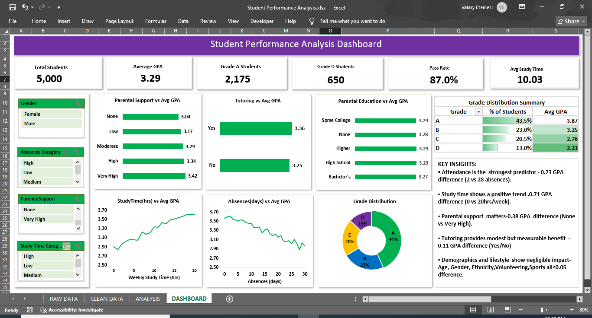

# Student Performance Analysis Dashboard

---

## Project Summary

Analysis of 5,000 student records to identify the key drivers of academic performance and translate findings into actionable insights for improving student outcomes. The project focuses on uncovering which factors most influence GPA performance using Microsoft Excel 2019.

---

##  Objective

To determine the strongest predictors of student performance and build an interactive dashboard that enables exploration of academic, behavioral and support-related factors affecting GPA.

---

##  Business Problem

Educational institutions often make decisions about student performance interventions based on assumptions rather than data. This leads to inefficient resource allocation and limited impact on student outcomes. This analysis addresses that gap by identifying evidence-based drivers of academic performance.

---

## Dataset Information

| Attribute | Details |
|---|---|
| Source | Kaggle Synthetic Student Performance Dataset |
| Records | 5,000 students |
| Variables | 15 |
| GPA Scale | 0.00 – 4.00 |

### Key Variables
- **Academic:** GPA, Grade Class, Weekly Study Time, Absences
- **Support:** Tutoring, Parental Support Level, Parental Education
- **Demographic:** Age, Gender, Ethnicity
- **Lifestyle:** Sports, Music, Volunteering, Extracurricular Activities

---

## Tools & Skills Used

| Tool/Skill | Application |
|---|---|
| Microsoft Excel 2019 | Primary analysis and dashboard tool |
| Power Query | Data cleaning and transformation |
| PivotTables | Aggregation and cross-tabulation of all variables |
| PivotCharts | Visual representation of findings |
| Slicers | Dynamic dashboard filtering |
| Conditional Formatting | Visual highlighting of grade performance tiers |
| Dashboard Design | Interactive single-page dashboard |
| Data Cleaning | Decoding, formatting and structuring raw data |
| Data Analysis | Factor ranking, trend analysis and insight generation |

---

## Data Preparation

### Cleaning Steps
The raw dataset contained numerically coded categorical variables requiring decoding before analysis:

- Binary variables (0/1) decoded to No/Yes for Tutoring, Sports, Music, Volunteering and Extracurricular
- Parental Support (0 to 4) decoded to None, Low, Moderate, High and Very High
- Grade Class (1 to 4) decoded to A, B, C and D
- Parental Education decoded to High School, Some College, Bachelor's, Higher and None

### Transformations Performed
- Decoded all numeric categorical codes to readable labels using Power Query
- Corrected data types for numeric and categorical columns
- Formatted GPA column to 2 decimal places
- Structured data into Excel Table format for efficient pivot table referencing
- Froze the first row containing column titles for easier navigation of the dataset
- Added two helper columns in the CLEAN DATA sheet to categorize continuous variables into meaningful bands: Absences Category (Low, Medium, High) and Study Time Category (Low, Medium, High) to power the corresponding dashboard slicers

---

## Dashboard Features

### KPIs
All six KPIs update dynamically when slicers are applied.

| KPI | Value |
|---|---|
| Total Students | 5,000 |
| Average GPA | 3.29 |
| Grade A Students | 2,175 |
| Grade D Students | 650 |
| Pass Rate | 87.0% |
| Avg Study Time | 10.03 |

### Filters / Slicers
All four slicers are connected to the KPIs, charts and Grade Distribution Summary table — every element on the dashboard updates simultaneously when a filter is applied.

- **Gender** — filter by student gender (Female/Male)
- **Absences Category** — filter by absence level (Low/Medium/High)
- **Parental Support** — filter by support level (None to Very High)
- **Study Time Category** — filter by study time level (Low/Medium/High)

### Charts & Visualizations
| Chart | Type | Purpose |
|---|---|---|
| Parental Support vs Avg GPA | Horizontal Bar | Shows GPA progression across support levels |
| Tutoring vs Avg GPA | Horizontal Bar | Compares GPA for tutored vs non-tutored students |
| Parental Education vs Avg GPA | Horizontal Bar | GPA across parental education levels |
| StudyTime(hrs) vs Avg GPA | Line Chart | Trend of GPA as weekly study hours increase |
| Absences(days) vs GPA | Line Chart | Trend of GPA as absences increase |
| Grade Distribution | Donut Chart | Breakdown of students by grade class |

### Grade Distribution Summary
A dynamic pivot table displaying grade class breakdown that updates with all four slicers. Conditional formatting has been applied to visually highlight performance tiers across the Grade, % of Students and Avg GPA columns.

---

## Key Drivers of Performance

| Factor | Impact Level | Effect |
|---|---|---|
| Absences | High | Strong negative impact on GPA — 0.73 GPA difference |
| Study Time | High | Strong positive impact on GPA — 0.71 GPA difference |
| Parental Support | Medium | Moderate positive influence — 0.38 GPA difference |
| Tutoring | Low | Minor improvement — 0.11 GPA difference |
| Demographics | Minimal | No significant impact — less than 0.05 difference |

---

## Key Insights

1. **Attendance is the most critical factor.** Students with 2 absences average a GPA of 3.61 compared to 2.88 for those absent 28 days, a difference of 0.73 and the largest gap of any variable tested.

2. **Study time shows a strong but non-linear relationship with GPA.** Performance rises from 2.90 at 0 hours per week to 3.61 at 20 hours per week, though fluctuations along the way suggest study quality and consistency matter as much as hours alone.

3. **Parental support is the strongest external predictor.** Very High parental support yields an average GPA of 3.42 compared to 3.04 with no support, confirming that family involvement has a measurable and meaningful academic impact.

4. **Tutoring provides modest but consistent benefit.** Tutored students average a GPA of 3.36 compared to 3.25 for those without tutoring, indicating that tutoring supplements but does not replace attendance and study habits.

5. **Demographic and lifestyle factors show negligible impact.** Age, gender, ethnicity, music, sports, volunteering and extracurricular activities all show GPA differences below 0.05, confirming that what students do matters far more than who they are.

---

## Recommendations

1. **Implement attendance monitoring programs.** Given attendance has the highest impact at a 0.73 GPA difference, schools should introduce early warning systems for students with rising absences.

2. **Promote structured study habit development.** Study time is the second strongest predictor and schools should incorporate study skills training into the curriculum.

3. **Strengthen parental engagement initiatives.** Parental support shows a 0.38 GPA difference and schools should create programs that actively involve parents in student academic life.

4. **Use tutoring as a supplementary tool.** Tutoring provides measurable benefit but should complement rather than replace attendance and study habit interventions.

5. **Avoid demographic-based academic assumptions.** Gender, ethnicity and age show negligible GPA differences and resource allocation should focus on behavioral interventions rather than demographic profiling.

---

## Dashboard Preview

---

## Files Included

| File | Description |
|---|---|
| `Student Performance Analysis.xlsx` | Full Excel workbook with RAW DATA, CLEAN DATA, ANALYSIS and DASHBOARD sheets |
| `Dashboard.PNG` | Dashboard preview image |
| `README.md` | Project documentation |

---

## How to Use

1. Download and open `Student Performance Analysis.xlsx` in Microsoft Excel 2019 or later.
2. Navigate to the **DASHBOARD** tab.
3. Use the four slicers (Gender, Absences Category, Parental Support and Study Time Category) to filter all visuals dynamically.
4. Explore the **ANALYSIS** tab to review all pivot tables and supporting calculations.
5. The Grade Distribution Summary updates automatically with all slicer selections.

---

## Author

**Valary Shikanda**
Data Analyst | BSc Information Technology — JKUAT

